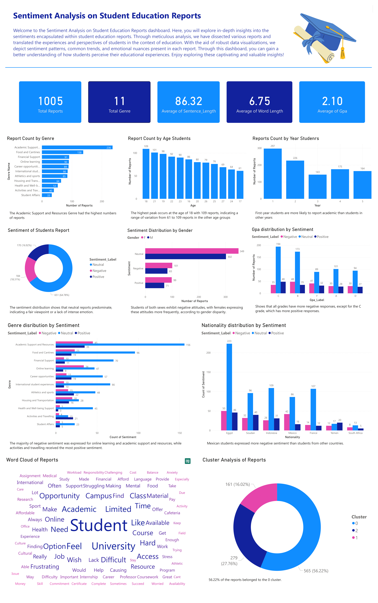

# **Education Analysis Clustering & Classification**

## **Description**
This project involves comprehensive sentiment analysis of student-submitted reports and complaints. With the aim of improving education quality, we seek to extract meaningful insights from these inputs, primarily to enhance student satisfaction and teaching quality. Through clustering and classification analysis techniques, our goal is to identify prevalent sentiment patterns and categorize report types for more effective solutions. This proactive project addresses educational concerns and positively influences students' learning experiences and educators' professional development.

## **Project Code:**
Steps:
1. Define Problem
2. Installing needed Libraries
3. Data Collection
4. Exploratory Data Analysis (EDA)
5. Data Cleaning
6. Data Visualization
7. Data Pre-Processing
   - Convert to lowercase
   - Remove special characters
   - Remove numbers
   - Remove Puctuation
   - Tokenize
   - Handle contractions
   - Remove Stopwords
   - Lemmatize
8. Feature Engineering
9. Vectorization using TF-IDF Vectorizer
10. Applying Clustering Algorithms
    - K-means Clustering
11. PCA to visualize important feature in data
12. Second Exploratory Data Analysis (EDA)
13. Moddeling
    - Sequence Padding
    - Double layer LSTM
14. Measure accuracy of models
15. Conclusion

## **Installation**
1. Clone the repository: `git clone https://github.com/Lexuz17/Sentiment_Education_Analysis_Clustering.git`
2. Install the required dependencies: `pip install -r requirements.txt`

## **Results and Findings**
The results of sentiment analysis on student reports provide valuable insights that can significantly enhance the performance of educational institutions, whether they are schools, universities, or other educational establishments. This analysis reveals several important findings:

1. The majority of sentiments identified are neutral, which dominates over negative and positive sentiments. The prevalence of neutral sentiment suggests that students are offering objective observations or factual statements without expressing clear sentiments.
2. When considering gender, it is apparent that male students tend to express more negative sentiments, although the majority of sentiments expressed are still neutral.
3. The analysis based on the Grade Point Average (GPA) indicates that most labels exhibit negative sentiment, except for GPA category C, which generates more positive sentiment.
4. When grouped by genre or topic, categories like "Academic Support" and "Athletics and Sports" have more reports with negative sentiment compared to other categories, while "Food and Catering" tends to have positive sentiment.

With this information, educational institutions have the opportunity to identify weaknesses or imbalances in their systems and implement necessary improvements to create a better learning environment. Based on these insights, I decided to build a model with a double-layer LSTM architecture, which has yielded promising results with an accuracy of 74% in testing.

The decision to employ this model after the clustering stage is rooted in a deeper approach. The input variable (X), which comprises the words within the reports, is linked to the clustering outcomes obtained through the K-Means method. The target variable (y), representing sentiment labels acquired from sentiment analysis using the TextBlob tool, is used for this purpose. By combining this information, I aim for the model to capture complex relationships and patterns among report content, clustering, and sentiment. The goal is to provide more profound insights for educational institutions to make more informed decisions.

## Contact
For any questions or inquiries, please contact jason.susanto1703@gmail.com

I have also developed a comprehensive Power BI report that offers insightful visualizations and data analysis.
